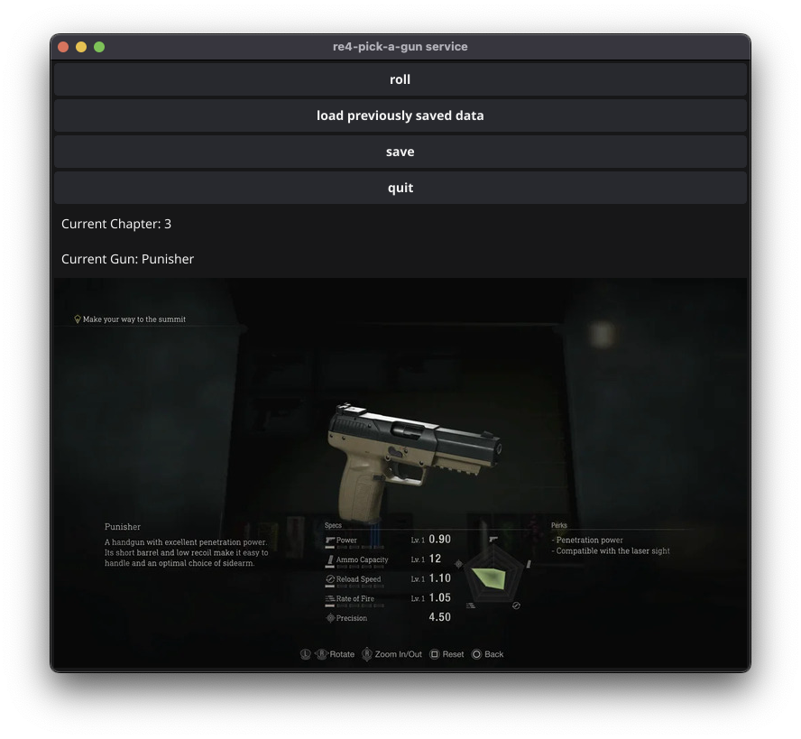

# The re4-pick-a-gun service!

I've over 200 hrs in RE4 and it is one of the best games of 2023.

I wanted to spice up my runs but choosing a random gun for every chapter.

I initially wrote this down in pen and paper but I lose those too easily.
I thought this would be a fun project for Golang and I'm presenting the pick-a-gun service!

## Feature
When starting a new game, start the app and it will pick a gun for the first chapter. Every time you finish the chapter, click `roll`


There is a save and load feature for saving your progress.


 

## Compiling on your machine

### Compiling for MacOS

After installing go dependencies run

```
fyne package -os darwin -icon icon.png
```

### Compiling for Windows

To compile for windows, I use fyne-cross. Builds into the fyne-cross directory which I've just gitignored.

```
fyne-cross windows -output re4-pick-a-gun -arch=amd64
```

run the .exe file that gets created in.

The save feature will save a file to `data.json`


## Desired features
- Pick a single weapon type(e.g. handguns only).
- Pick a custom list of weapons.
- Save multiple files.
- re-roll


## References

[fyne-cross](https://github.com/fyne-io/fyne-cross) 
